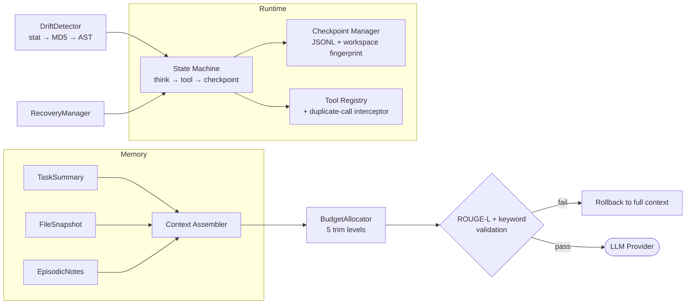

# Tether

**A memory-and-context management layer for long-running LLM coding agents — with real, reproducible benchmarks.**

Tether is an experimental agent runtime that answers a practical question: *as a coding agent works for hours, how do you keep its context small, its memory correct, and its progress recoverable — without silently losing information?*

It is built as a pipeline of independently testable components (state machine → three-layer memory → budget-allocated compression → drift detection → smart recovery → tool interception), and every claim in this README is backed by a benchmark you can run yourself.

> **Positioning.** Tether is not chasing SOTA compression ratios (LLMLingua-style learned compressors reach 10–20×). It is a *deterministic, zero-model* pipeline whose value proposition is verifiable safety: every compression is validated (ROUGE-L + keyword survival) and rolled back when it would lose information. The benchmarks below measure exactly that trade-off.

## Architecture



| Phase | Component | What it does |
|-------|-----------|--------------|
| 1 | `runtime/` `checkpoint/` | Async state machine, JSONL checkpoints, tool timeout breaker |
| 2–3 | `memory/` `context/` | Three-layer memory (TaskSummary / FileSnapshot / EpisodicNotes) + budget-allocated context assembly |
| 4 | `context/validator.py` | ROUGE-L + keyword compression validation with rollback |
| 5 | `filesystem/drift.py` | Three-level file drift detection (stat → MD5 → AST symbols+signatures) |
| 6 | `checkpoint/recovery.py` | Drift-aware recovery planning across 10 interruption scenarios |
| 7 | `tools/` | Tool registry with duplicate-call interception (5s window) |
| 8 | `benchmarks/` | 6 benchmark experiments with baselines and ablations |
| 9 | `llm/` | OpenAI-compatible provider layer (DeepSeek tested) + offline mock |

## Benchmark Results

All numbers below are produced by the code in this repository. Run `python scripts/run_benchmark.py --all` to reproduce the five offline experiments; see [Reproducing the e2e experiment](#reproducing-the-e2e-experiment) for the real-LLM one. Per-experiment Markdown reports are committed under `src/tether/benchmarks/results/`; raw JSON/CSV dumps regenerate deterministically (seeded) via the same command.

### 1. Context compression (20 HumanEval tasks, offline validation)

| Strategy | Prompt tokens | Information preserved |
|----------|--------------|----------------------|
| Full context (baseline) | 681 | 100% |
| Last-N truncation | 537 (−21%) | **65%** — drops early tool results |
| **BudgetAllocator (ours)** | **574 (−16%)** | **100%** — ROUGE-L validated, rollback on failure |

### 2. Real-LLM end-to-end, pass@1 (20 HumanEval tasks × 3 arms, DeepSeek, greedy decoding)

Each arm sends a realistic agent context (task summary, file snapshots, tool history, episodic notes) + the task to `deepseek-v4-flash`; the completion is executed against the official HumanEval tests.

| Arm | pass@1 | Avg prompt tokens | Avg total tokens (incl. reasoning) | Avg latency |
|-----|--------|-------------------|-----------------------------------|-------------|
| Full context | 65% (13/20) | 795 | 4548 | 77.2s |
| Last-N | 80% (16/20) | 673 | 2760 | 49.0s |
| **BudgetAllocator (ours)** | **80% (16/20)** | 708 (−11%) | 3609 (**−21%**) | 62.3s |

Takeaway: at n=20 the pass@1 differences are within noise, but the compressed arms *never underperform* the full context while cutting total token cost by 21% — consistent with shorter contexts reducing distraction for reasoning models ("lost in the middle"). Most non-passes are reasoning-budget exhaustion (empty completions at the 8192-token cap) on the lightweight flash model, not wrong code.

### 3. Memory ablation (20 tasks)

| Memory config | Avg disk reads / task | Stale reads | Task success |
|---------------|----------------------|-------------|--------------|
| No memory | 30 | 6 | 100% (slow) |
| Flat cache | 2 | 5.5 | **45%** — stale-data failures |
| **Three-layer (ours)** | **2** | **0** | **100%** |

### 4. File drift detection (10 change types × 10 samples)

**100/100 accuracy** (0 false positives, 0 false negatives), avg **1.3ms** per file. Covers content edits, comment/whitespace changes, appends, deletion, rename, function add/remove/rename, signature changes, and concurrent multi-file edits.

### 5. Recovery (10 interruption scenarios × 5 runs)

**90% overall** recovery success, avg 0.6 steps lost. Nine scenarios recover 100%; `file_deleted` is honestly 0% — snapshots store metadata, not content, so external deletion is unrecoverable by design (documented limitation, not hidden).

### 6. Duplicate-call interception (20 simulated tasks)

**100% interception** (60/60 duplicate calls in the 5s window), saving 5100 tokens of redundant tool output.

## Quickstart

```bash
git clone https://github.com/<you>/tether.git
cd tether
pip install -e ".[dev]"
python -m pytest tests/ -q          # 63 tests, all offline
```

Run the offline benchmarks:

```bash
python scripts/run_benchmark.py --all            # 5 offline experiments
python scripts/run_benchmark.py --experiment compression --num-samples 5
```

### Reproducing the e2e experiment

```bash
export DEEPSEEK_API_KEY=sk-...            # any OpenAI-compatible key works via TETHER_LLM_* vars
export TETHER_LLM_MODEL=deepseek-v4-flash
python scripts/run_benchmark.py --experiment e2e --num-samples 20
```

Without an API key the experiment falls back to an offline `MockProvider` and flags every result (`is_mock: true`) — the pipeline stays runnable in CI at zero cost.

## Limitations (read before citing numbers)

- **e2e sample size is small** (20 tasks × 3 arms). Differences of ≤15 percentage points are within noise; we report them as directionally consistent, not significant.
- **Code execution is not sandboxed.** HumanEval completions run in a plain subprocess with a 10s timeout (standard practice, but do not point this at untrusted models).
- **`file_deleted` recovery is impossible** by design (metadata-only snapshots); the DriftDetector still flags it.
- **The drift test set is self-constructed** (10 change types × 10 samples). 100% accuracy means the ten mutation classes are covered, not production-level generalization.
- **HumanEval subset is bundled offline** (20 problems) because the build environment had no network access to the upstream repo.
- **Compression ratios are modest** (16–21%) vs learned compressors; the trade is a hard semantic-preservation guarantee.

## Project Layout

```
src/tether/
├── runtime/        # state machine + main loop
├── checkpoint/     # JSONL checkpoints + smart recovery
├── memory/         # TaskSummary / FileSnapshot / EpisodicNotes
├── context/        # BudgetAllocator + ROUGE-L validator + assembler
├── filesystem/     # DriftDetector (stat → MD5 → AST)
├── tools/          # registry + duplicate-call interceptor
├── llm/            # OpenAI-compatible provider + offline mock
└── benchmarks/     # 6 experiments, metrics, reports, datasets
tests/              # 63 tests (all offline)
docs/designs/       # per-phase design documents (HOTL contracts)
```

## License

MIT — see [LICENSE](LICENSE).
